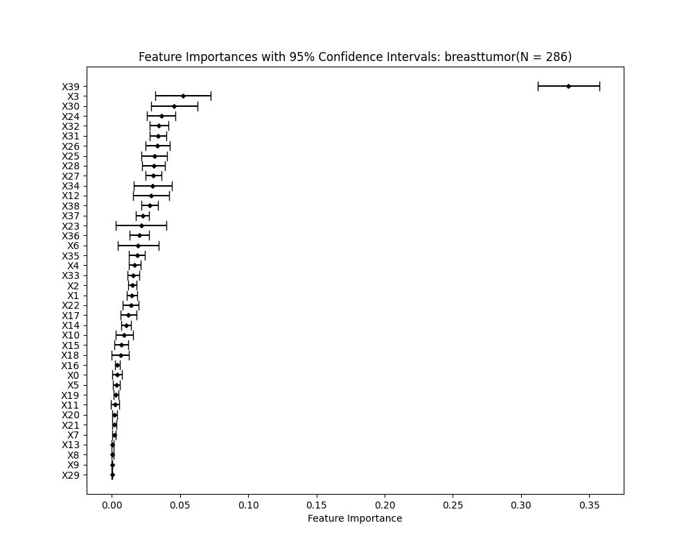
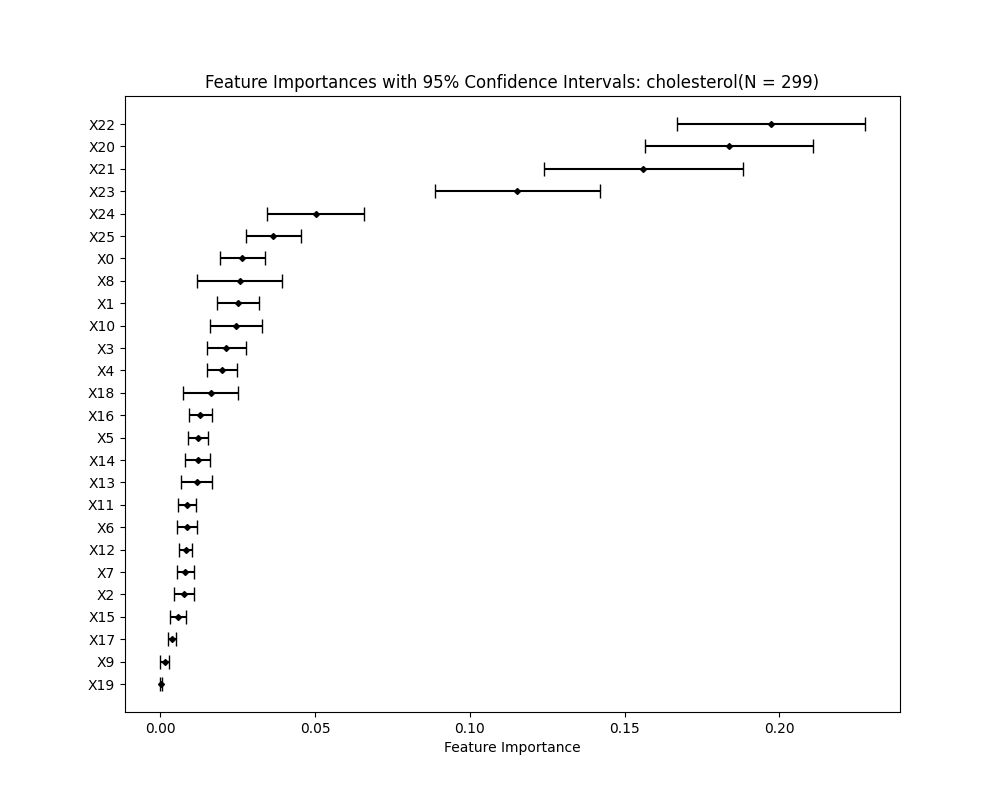
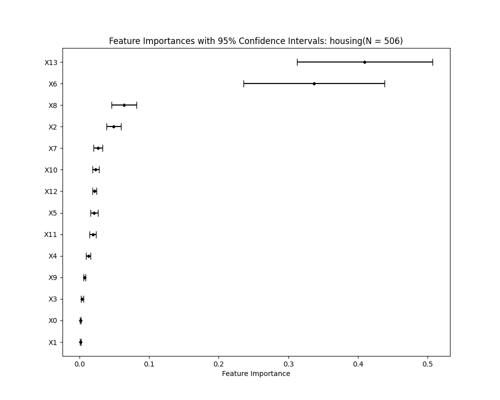
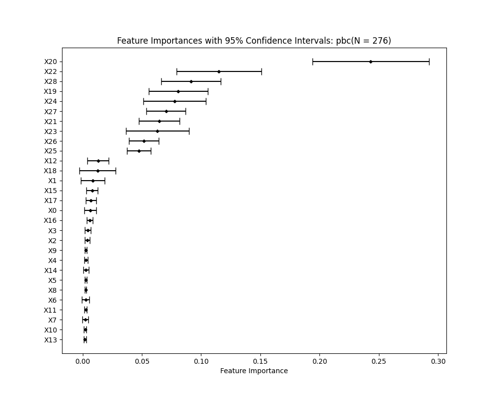
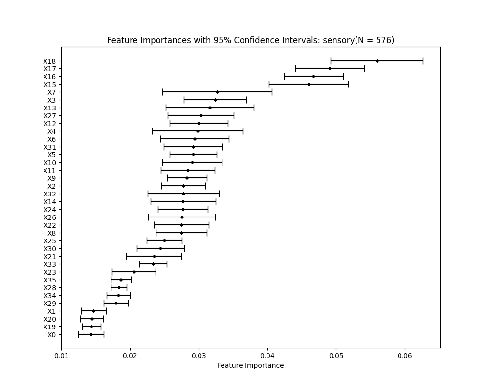
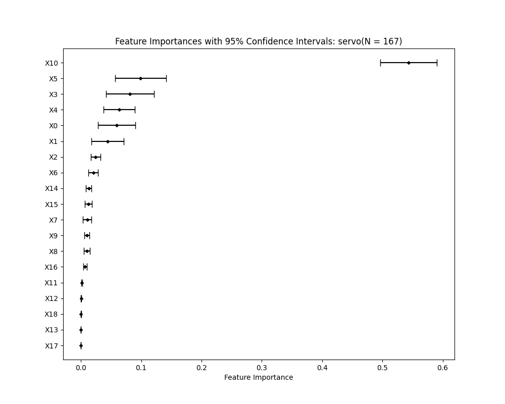

# Ensemble method in Interval Regression

## Overview

Interval regression is a type of regression analysis where the target variable is an interval rather than a single point. Unlike point regression, which aims to model the data points as closely as possible, interval regression focuses on intersecting with all the intervals while maximizing the distance between the model and the interval endpoints (lower and upper limits).

### Key Differences between Point Regression and Interval Regression

- **Point Regression:** The goal is to fit a model that closely follows the data points, minimizing the error between the predicted values and the actual data points. The most common loss function used here is the Mean Squared Error (MSE).
  
- **Interval Regression:** The goal is to create a model that intersects with all given intervals, aiming to maximize the distance between the model and the interval endpoints. This approach uses a different loss function, specifically the squared hinge error.

### Visual Comparison

Point regression and interval regression can be visually distinguished by how the model aligns with data points versus intervals.

## Previous Methods

- **Linear Approaches:**
  - **Max Margin Interval Regression:** A linear approach that focuses on maximizing the margin between the predicted line and the interval boundaries.
  - **Max Margin Interval Regression L1 Regularization:** A linear approach that focuses on maximizing the margin between the predicted line and the interval boundaries using L1 regularization to choose the most impactful features.
  
- **Tree-Based Approaches:**
  - **Maximal Margin Interval Tree (MMIT):** A decision tree-based method that builds trees by maximizing the margin at each split to best fit the intervals.

## Proposed Method

The proposed method enhances interval regression using a multi-layer perceptron (MLP) model with feature selection. The process involves:

1. **Feature Selection:**
   - Employing `n` (I used `n = 10`) random forest models to determine feature importance.
   - Selecting features based on their importance scores, ensuring that the most impactful features are included in the model.

2. **Model Architecture:**
   - Implementing a multi-layer perceptron (MLP) to capture complex relationships between features and the target intervals.

3. **Training Strategy:**
   - The MLP is trained by minimizing the squared hinge loss, which is specifically tailored for interval regression tasks.

4. **Performance:** 
   - Preliminary results indicate that this approach outperforms traditional methods, especially in cases with complex data patterns where linear or tree-based methods may fall short.

## Implementation
- **Linear Models:** Utilizing the R package [penaltyLearning](https://cran.r-project.org/web/packages/penaltyLearning/index.html)
  - **Without Regularization:** Applies the Max Margin Interval Regression model, incorporating all possible features.
  - **L1 Regularization:** Uses the Max Margin Interval Regression model with L1 regularization. The L1 regularization parameter (`L1_reg`) starts at 0.001 and is progressively multiplied by 1.2 until no features are selected. Cross-validation is employed to determine the optimal `L1_reg` value from the training data.
  
- **MMIT (Max Margin Interval Trees):** Implemented using the R package [mmit](https://github.com/aldro61/mmit)
  - Cross-validation (`cv = 2`) is used to select the best hyperparameters for the tree. The hyperparameter lists include:
    - `max_depth_list = (1, 2, 3, 5, 7, 10, 20, 50, 100, 200, 500, 1000)`
    - `min_sample_list = (2, 5, 10, 30, 50, 100, 300, 500)`
  
- **Ensemble (Random Forest + Multi-Layer Perceptron):**
  - **Feature Selection:**
    - 10 Random Forest model is used to determine the mean feature importance from only the training data, not the test data.
    - Features are selected based on thresholds (0.5 and 0.75 are implemented): Features are sorted by importance, and the subset is chosen by selecting from the top until the cumulative importance exceeds the threshold.

<table>
  <tr>
    <td>
      
    </td>
    <td>
      
    </td>
  </tr>
  <tr>
    <td>
      
    </td>
    <td>
      
    </td>
  </tr>
  <tr>
    <td>
      
    </td>
    <td>
      
    </td>
  </tr>
</table>
  
  - **Multi-Layer Perceptron (MLP) Implementation:**
    - **1 Hidden Layer:** 20 neurons.
    - **2 Hidden Layers:** 20 neurons in each hidden layer.
    - **Overfitting Prevention:** The training set is split into sub-training and validation sets. Training is stopped when the validation loss does not decrease for a specified number of epochs (`patience`): 20 epochs for the 1-layer MLP, and 30 epochs for the 2-layer MLP.

## Future Work

- **Hyperparameter Tuning:** Further exploration into optimal configurations for the MLP, including the number of layers, neurons per layer, and activation functions.
- **Generalization:** Evaluating the proposed method across different datasets to confirm its robustness and generalizability.

## Copyright
Unless otherwise stated, all content in this repository is licensed under the [Creative Commons Attribution 4.0 International License](https://creativecommons.org/licenses/by/4.0/). You are free to:
- Share — copy and redistribute the material in any medium or format
- Adapt — remix, transform, and build upon the material for any purpose, even commercially.